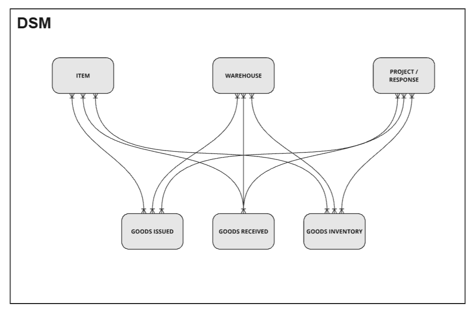

# Data model description

## Dimension entities

`Item`, `Warehouse` and `Project/Response` are dimension entities. Each entity contains only unique records. For example, Item entity stores list of unique item. There should no duplicate in these entities.

Data of these entities come from Form 1 - New registration. Data entries are filtered based on selection of the question "Select what you would like to register". If a submission selects "New item", data of this submission will be recorded in `Item` entity.

## Fact entities

Data in `Goods Issued` and `Goods Received` entities are fact entity. They register activities at a warehouse when goods are leaving or entering.

Data of these entities come from Form 2 - Warehouse management. Data entries are filtered based on selection of the question "Action". If a submission selects "Goods Issued", data of this submission go to the corresponding entity.

Entity `Goods Inventory` contains data that are consolidates from `Goods Issued` and `Goods Received`.

## Relationships

Relationship are made from the dimension entities `Item`, `Warehouse` and `Project/Response` to fact entities `Goods Inventory`, `Goods Issued` and `Goods Received`.

In the Kobo forms, these relationships are implemented with [Dynamic Data Attachment](https://support.kobotoolbox.org/dynamic_data_attachment.html). When registering `Goods Issued`, the right information of item, warehouse, project are retrieved to the data entry.

In the dashboard of Power BI, these relationships are more visible. When an item is selected in "Item name" filter, the dashboard will be filtered accordingly to visualise only information related to the item.